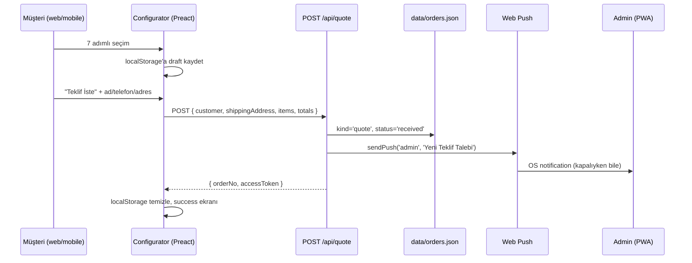
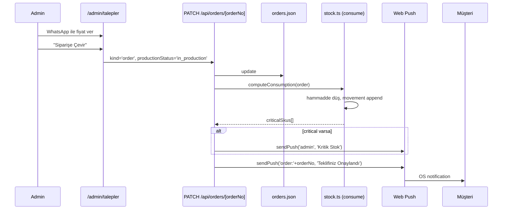
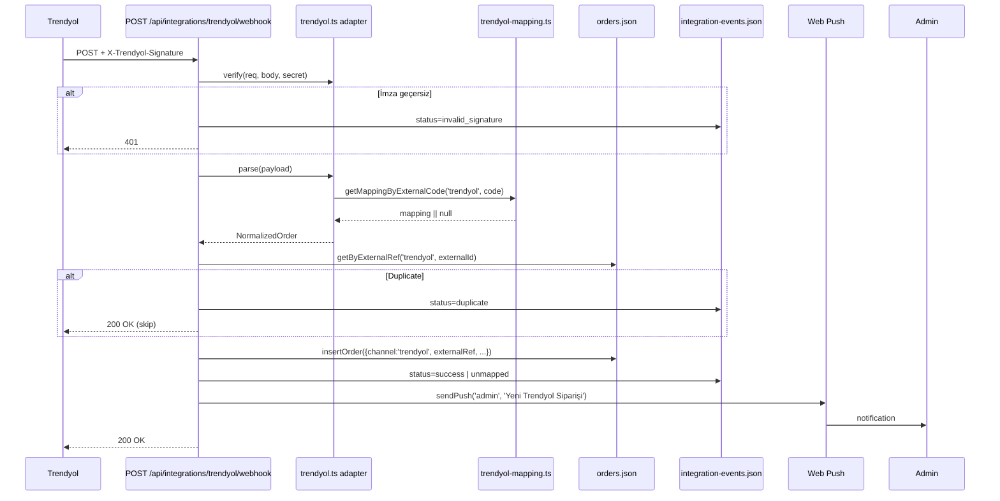
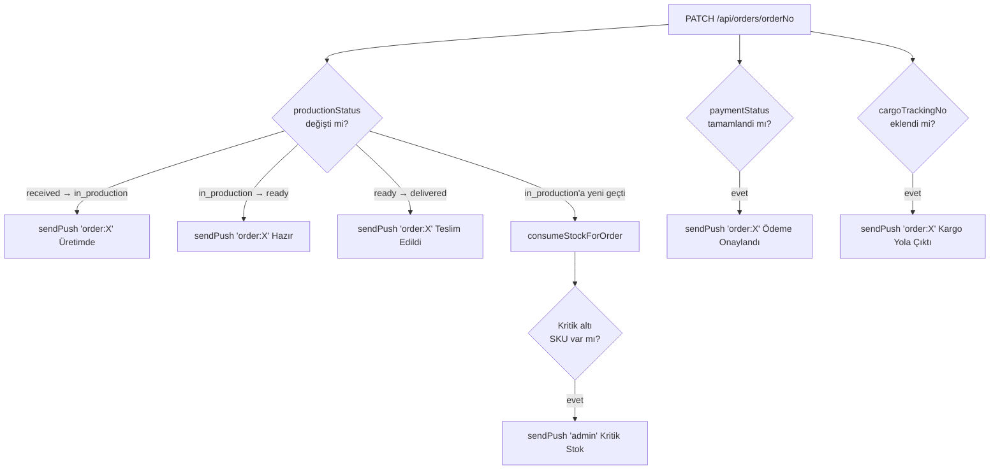

# Veri Akışı

## 1) Müşteri talep akışı (Konfigüratörden ön sipariş)

## 2) Admin teklif → kesin sipariş dönüşümü

## 3) Trendyol webhook akışı

## 4) Sipariş status değişimi → push fan-out

## For an AI agent
- Push fan-out tetikleyicileri tek dosyada: `apps/web/src/pages/api/orders/[orderNo].ts`
- Stok consume hook'u aynı dosyada — çift yere yazma
- Webhook adapter'ları registry pattern: yeni platform = `registry.ts` + `<platform>.ts` + webhook endpoint
